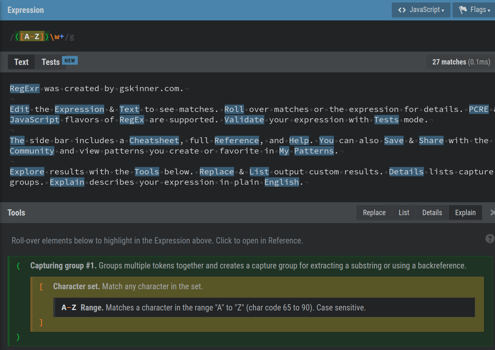
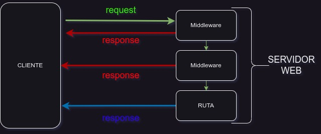
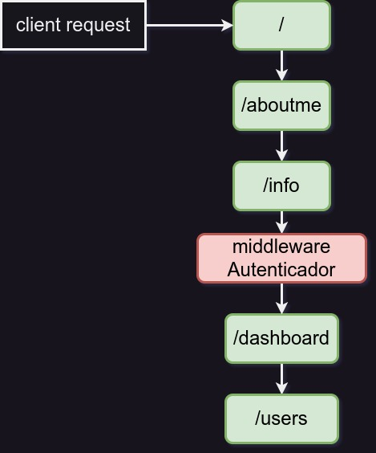

# Introducción

Hola a todos! Mi nombre es Camilo Canclini y soy desarrllador web junior. Hago este curso a modo de resumen, si se quiere, y para documentar todo lo que vaya aprendiendo. Soy una persona que, a día de la fecha, esta emprendiendo su camino en la programación. Me encuentro aprendiendo diferentes tecnologías web. Este curso es la continuación del curso de NodeJs.

La metodología de estudio que llevo a cabo consta de los siguientes pasos:

* Definir que se va a estudiar, desde donde y hasta donde.

* Busco que conocimientos se requieren, o se recomiendan, para entender las distintas tecnologías/lenguajes de hoy en día.

* Busco documentación confiable, estructuras, road maps, y realizo una especie de ruta de conceptos

* Me apoyo en distintas fuentes

* Realizo resumenes mientras que escucho o leo el material

* Realizo mini-practicas y pruebo lo que voy aprendiendo

Esta forma de estudiar, es la que vengo utilizando para estudiar programación. No siempre soy tan estructurado, pero me gusta seguir un método para estudiar. Obviamente no es la única forma de estudiar, pero es con la que mas comodo me siento y la que mejor se adapta a mis necesidades. Algo que cabe aclarar es que soy el tipo de estudiante que, le gusta entender de donde vienen los temas que se me presentan, cuales son las bases sobre las que trabajan, como funcionan internamente, para que nos sirven en la práctica, etc. Por lo que, con mis "cursos" busco siempre explicar todo el contenido, que se relacione con el tema que se esta estudiando. No me agrada la idea de dejar conceptos sin explicar o, palabras y frases que no se entienden. Esto no quiere decir que me explayo o explico absolutamente todos los temas, por razones obvias no podemos explicar todo, porque se haría muy tedioso, y tampoco seria útil. Todo dependera de la importancia del tema a estudiar, si este se relaciona con muchos otros conceptos, y/o además es la base de otros temas, entonces se explicará en profundida, sino, se mencionará lo fundamental y práctico.

La finalidad de este curso será la de, brindar material de estudio para todas aquellas personas que quieran consultar sobre ciertos temas relacionados con el curso, presentar mi métodologia de estudio, y dejar documentado mi aprendizaje. Soy consciente que este curso puede, no solo servirme a mi, sino tambien, a cualquier otra persona que, por una u otra razón, haya llegado hasta aquí. Por ende, sientete libre de compartir este recurso con la comunidad.

## Requerimientos

Este curso es la continuación de otro de mis "cursos", el curso de NodeJs. Segun lo que he investigado, Express, React y otros frameworks, tienen su base en NodeJS. Por lo que, opté por iniciar estudiando Node y con eso todos sus módulos mas importantes. Hoy en día puedo decir que ese curso me ha hecho adquirir una base muy solida para afrontar demas tecnologías.

Mi recomendación es que, revisen el temario del curso que se realizó de Node, y en lo posible empezar primero con eso. Ahora, si por cualquier otra razón, considera que poseé los conocimientos necesarios, aunque sea revise la parte que hablamos de HTTP, el módulo HTTP, encriptación, y todos los temas afines.

Una vez dicho esto, podemos comenzar.

## Express Framework


Express es un framework de Nodejs que proporsiona una serie de métodos e infrastructura para desarrollar aplicaciones web. Con esto podría surguir otra pregunta: ¿Qué es un framework?, un framework se traduce como "marco de trabajo", esto hace alusión al hecho de que tenemos una serie de herramientas y tecnicas que se enfoncan a solucionar un determinado problema, por ende, podemos definir un framework como: Un conjunto de herramientas, bibliotecas y convenciones de programación que se utilizan para desarrollar aplicaciones de manera más rápida y eficiente. Un framework proporciona una estructura básica para una aplicación y establece patrones y prácticas recomendadas para desarrollar aplicaciones.

Un buen framework debe ser fácil de aprender y utilizar, pero también flexible y escalable para que puedas adaptarlo a las necesidades específicas de tu aplicación. Hay frameworks para una amplia variedad de lenguajes de programación y tipos de aplicaciones, incluyendo frameworks web para crear aplicaciones web, frameworks de escritorio para crear aplicaciones de escritorio y frameworks móviles para crear aplicaciones móviles.

Express es uno de los frameworks web más populares y utilizados en la comunidad NodeJs debido a su facilidad de uso y flexibilidad. Gracias a las características que mencionamos antes, es podemos decir que los frameworks ofrecen una manera, más optima o eficiente de realizar las mismas tareas que realizamos con el lenguaje por "defecto". Por ejemplo en NodeJs, podemos utilizar el modulo `http` para crear servidores web, lo cual, desde un principio es mas engorrozo que si lo hicieramos con Express.


### http module vs express app

HTTP MODULE

```js
const http = require('http');

const server = http.createServer((req, res) => {
  if (req.url === '/') {
    res.writeHead(200, {'Content-Type': 'text/plain'});
    res.write('Hola, Mundo');
    res.end();
  } else if (req.url === '/acerca-de') {
    res.writeHead(200, {'Content-Type': 'text/plain'});
    res.write('Esta es la página de información acerca de la aplicación');
    res.end();
  } else if (req.url === '/contacto') {
    res.writeHead(200, {'Content-Type': 'text/plain'});
    res.write('Esta es la página de contacto');
    res.end();
  } else {
    res.writeHead(404, {'Content-Type': 'text/plain'});
    res.write('Página no encontrada');
    res.end();
  }
});

server.listen(3000, () => {
  console.log('El servidor está funcionando en el puerto 3000');
});

```

EXPRESS APP

```js
const express = require('express');
const app = express();

// Ruta para la página principal
app.get('/', (req, res) => {
  res.send('Hola, Mundo');
});

// Ruta para la página Acerca de
app.get('/acerca-de', (req, res) => {
  res.send('Esta es la página de información acerca de la aplicación');
});

// Ruta para la página de Contacto
app.get('/contacto', (req, res) => {
  res.send('Esta es la página de contacto');
});

// Iniciar el servidor en el puerto 3000
app.listen(3000, () => {
  console.log('El servidor está funcionando en el puerto 3000');
});
```

A simple viste podemos ver que, no solo se utilizan menos lineas de código para realizar **la misma tarea**, sino que, además, el código se vuelve mucho mas legible y simple.

Cuando usamos frameworks se nos dice que estos simplifican enormemente el desarrollo, asi como tambien la escalabilidad del mismo a lo largo del tiempo, esto quiere decir que, a la larga es mucho mas facil mantener o trabajar sobre un servidor que utiliza express que uno sobre el que no.

Pero ahora bien, para poder entender el funcionamiento, particularmente de Express, necesitamos entender antes el modulo http, el protocolo http, como funcionan las redes hoy en dia, el modelo tcp/ip, protocolos de seguridad, modelo cliente-servidor, etc. Existen muchos conceptos que **deberíamos** abordar al momento de empezar a estudiar Express, ya que son esas mismas tecnologias sobre las que el framework trabaja y hace el trabajo de fondo que nosotros "no vemos". Por eso, recomendamos primero tener una buena base de Node.

### ¿Qué podemos hacer con Express?

* Enrutamiento: Express proporciona una manera sencilla de definir rutas y manejar solicitudes HTTP utilizando métodos HTTP como GET, POST, PUT, DELETE, etc.

* Middleware: Express utiliza middleware para manejar solicitudes HTTP y respuestas. Esto significa que puedes agregar funciones a la cadena de middleware para realizar tareas como analizar datos de solicitud, autenticación, registro de solicitudes, etc. **El concepto "middleware" lo veremos mas adelante**

* Integración fácil con otras bibliotecas y frameworks: Express se integra fácilmente con otras bibliotecas y frameworks de Node.js, lo que lo hace muy flexible y adaptable.

* Plantillas: Express permite utilizar diferentes motores de plantillas (como Pug, Handlebars, EJS, etc.) para generar HTML dinámico en el servidor.

* Manejo de errores: Express proporciona un sistema de manejo de errores que permite personalizar las respuestas de error y manejar errores de manera efectiva.

* Middleware de terceros: Hay una gran cantidad de middleware de terceros disponibles para Express, lo que lo hace aún más poderoso y fácil de usar.
Por estas razón Express es una excelente opción para construir aplicaciones web escalables y eficientes en el lado del servidor.

### Video Curso ExpressJs por Fazt

[Express Framework de Nodejs, Curso para principiantes (Javascript en el backend)](https://www.youtube.com/watch?v=JmJ1WUoUIK4)

Este video puede ayudar a entender Express.

### Documentación Oficial De Express

[expressjs.com](https://expressjs.com/es/starter/installing.html)

Para este curso nos basaremos principalmente en la documentación oficial, aunque, no descartamos la posibilidad de utilizar recursos de terceros.

### Instalación Express

Una vez que iniciamos el repositorio/paquete con `npm init`:

```bash
npm install express --save
```

Si no especificamos el argumento `--save`, express no aparecerá como dependencia del proyecto, y por ende, cuando llevemos el proyecto a producción deberemos instalarlo manualmente, en vez de usar tan solo `npm install`, el cual, instala todas las **dependencias** del proyecto.

### Importación Framework Express

Una vez que se a instalado, podemos importarlo en nuestro código con la siguiente línea

```js
const express = require('express'); // CommonJs 
```

```js
import { Express } from 'express'; // ESMACScript 6 - ES Modules
```

### Direccionamiento

Cuando hablamos de direccionamiento en web, nos referimos a el proceso que realiza nuestro servidor a la hora de "escuchar" o administrar los distintos endpoints del sistema.

Los **Endpoints** no son mas que URLs específicas en un servidor que se utilizan para acceder a un **recurso** o **servicio** en particular. Por ejemplo un endpoint podria ser, `GET http://localhost/products`, el cual podría devolver todos los productos cargados en nuestro sistema.

Con administración de estos endpoints, nos referimos tanto a las respuestas que da nuestro servidor a estas rutas, como tambien a la forma en la cual se acceden a estas rutas. En este caso, los métodos HTTP.


En concreto en Express el direccionamiento se utiliza para definir cómo manejar las solicitudes GET, POST, PUT, DELETE y otras. Podemos especificar la ruta de acceso (o URL) y el método HTTP en la función de manejo de solicitudes para que nuestro servidor sepa qué hacer cuando se recibe una solicitud que coincide con la ruta y el método especificados.

```js
var express = require('express');
var app = express();

// Responde un 'Hola Mundo' cuando se accede a la ruta raiz con el método GET
app.get('/', function(req, res) {
  res.send('hello world');
});
```

En Express los endpoints se representan de la siguiente manera:

```js
app.METHOD(PATH, HANDLER)
```

* `app` es una instancia de express.
* `METHOD` es un método de solicitud HTTP.
* `PATH` es una vía de acceso en el servidor.
* `HANDLER` es la función que se ejecuta cuando se correlaciona la ruta.

Ejemplos:

```js
app.get('/', function (req, res) {
  res.send('Hello World!');
});

app.post('/', function (req, res) {
  res.send('Got a POST request');
});

app.put('/user', function (req, res) {
  res.send('Got a PUT request at /user');
});

app.delete('/user', function (req, res) {
  res.send('Got a DELETE request at /user');
});
```

Además existen un 'Metdo Especial' que proporciona express que es: `app.all(url,callback)`, el cual no verifica el método con el que se solicita. Si es GET, POST, PUT o DELETE, lo ignora y siempre devuelve el "mismo mensaje"

```js
app.all('/secret', function (req, res, next) {
  console.log('Accessing the secret section ...');
  next(); // pass control to the next handler
});
```

Otra característica, es que, Express permite integrar expresiones regulares, para escuchar sus distintas rutas, o **vías de acceso**, como las llama Express. Para esto utiliza la libreria `path-to-regexp`.

Una expresión regular (también conocida como regex o regexp) es una secuencia de caracteres que describe un patrón de búsqueda. Las expresiones regulares se utilizan para buscar y manipular cadenas de texto de forma eficiente y precisa.


Por ejemplo:



En este caso lo que busco es un patron en el cual, una palabra empiece con mayuscula hasta que haya, un espacio por ejemplo. Entonces solo me marca las palabras que empiezan con mayuscula en un texto.

Este tema puede ser muchisimo mas complejo, por eso, no entraremos en muchos detalles, aunque si desea practicar expresiones regulares, visite la siguiente página: [https://regexr.com/](https://regexr.com/)

Volviendo a Express, este nos permite realizar busquedas en nuestras **Vías de Acceso** con patrones de expresiones regulares, y como dijimos antes, este utiliza, internamente, la librería `path-to-regexp`. He aquí algunos ejemplos:

```js

// Esta vía de acceso de ruta coincidirá con abcd, abbcd, abbbcd, etc.
app.get('/ab+cd', function(req, res) {
  res.send('ab+cd');
});

// Esta vía de acceso de ruta coincidirá con acd y abcd.
app.get('/ab?cd', function(req, res) {
  res.send('ab?cd');
});

// Esta vía de acceso de ruta coincidirá con abcd, abxcd, abRABDOMcd, ab123cd, etc
app.get('/ab*cd', function(req, res) {
  res.send('ab*cd');
});
```

### Middlewares

Un **Middlewares** es un programa o función que procesa los datos enviados desde un punto A a un punto B. Este puede tener distintas funciones como: filtrar, depurar, formatear, autentificar, registrar, entre otras.


En el caso de Express los middleware son funciones que tienen acceso al objeto de solicitud (`req`), al objeto de respuesta (`res`) y a una función conocida como `next()`, que permite enviar la información al siguiente middleware.

> Si la función de middleware actual no finaliza el ciclo de solicitud/respuestas, debe invocar next() para pasar el control a la siguiente función de middleware. De lo contrario, la solicitud quedará colgada.



En la imagen anterior podemos ver como en nuestro servidor pueden existir uno o varios middleware, los cuales reciben el `req`, procesan la información y, si todo esta correcto, pasan al siguiente, de lo contrario devuelven una respuesta al cliente.

Un ejemplo en código podría ser el siguiente:

* Creamos una función que escriba un registro cada vez que recibimos una petición.

  ```js
  var myLogger = function (req, res, next) {

  console.log(`Peticion: URL: ${req.url}, METHOD ${req.method}`);

  next();//Pasamos al siguiente middleware

  };

  ```
  
  Como podemos ver, la función acepta 3 parametros, `req`, `res` y `next`. Una forma fácil de verificar si la funcion que estas invocando es un middleware es mirar si acepta como parametro `next`.

* Ahora, para integrar el middleware al servidor debemos hacer uso del método que nos provee Express con el objeto `app`, el cual es: `app.use(middleware)`.

  ```js
  var express = require('express');
  var app = express();

  var myLogger = function (req, res, next) {
    console.log('LOGGED');
    next();
  };

  app.use(myLogger);

  app.get('/', function (req, res) {
    res.send('Hello World!');
  });

  app.listen(3000);
  ```

  De esta manera, cada que vez que se ingrese a la ruta raiz (`'/'`), primero se tendrá que pasar por el middleware, el cual registrara la ruta y el método con el que se esta intentando acceder.

  **Algo a considerar:** El middleware, tiene efecto para todas las rutas que se encuentren debajo del `app.use()`, si existe alguna ruta declarada, arriba del `app.use()` entonces el middleware no lo interceptará.

  

  En el ejemplo anterior podemos ver que la request del cliente, por decirlo de algun modo, "pasa por todas las rutas de la aplicación", pero solo la "aceptará" la ruta que coincida con la url que viene especificada en la request. Si se accede a las tres primeras rutas no pasará nada, cualquier cliente puede ingresar.
  
  Sin embargo, si un cliente intenta ingresar a las 2 últimas rutas, entonces, por ejemplo, podríamos poner alguna tipo de función de autenticación que verifique las credenciales del cliente. Si este envía las credenciales en su petición, entonces podrá acceder a las rutas posteriores a esta verificación, de lo contrario, se le negará el acceso, y podríamos devolver algun mensaje de estado. Como por ejemplo: `HTTP 401: "Usuario No Autorizado"`.

#### Tipos de Middlewares en Express